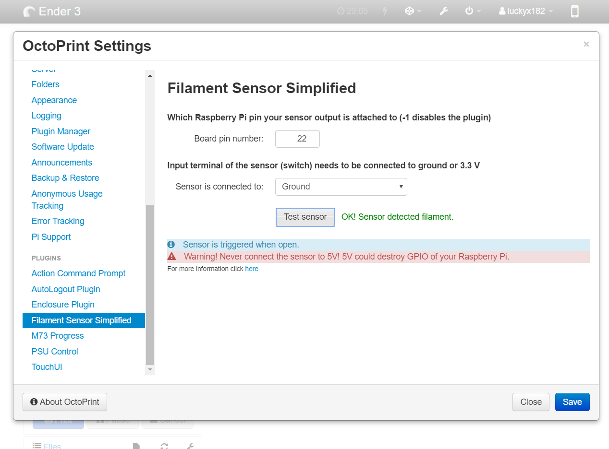
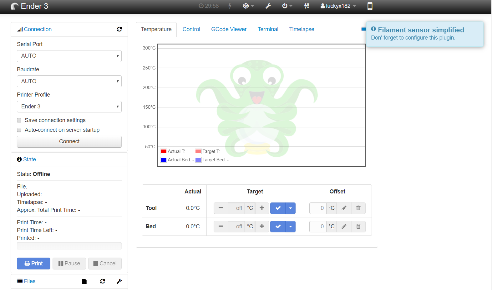
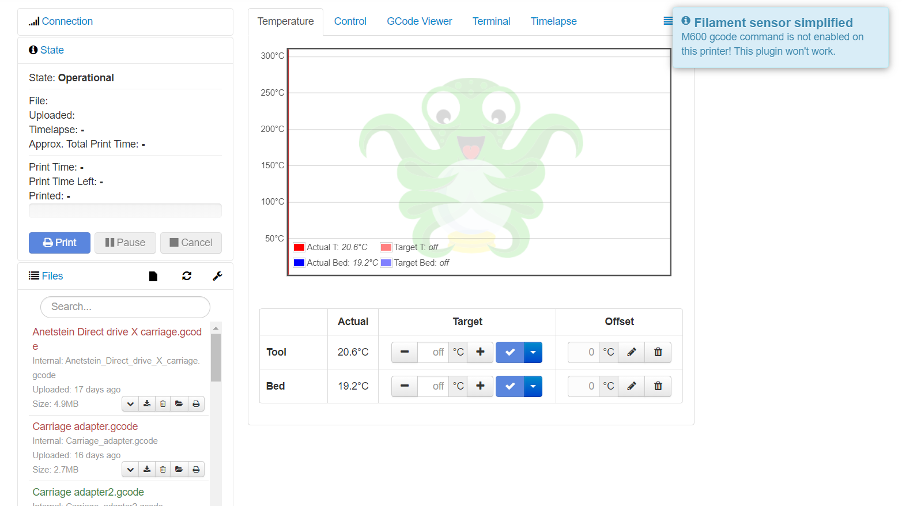
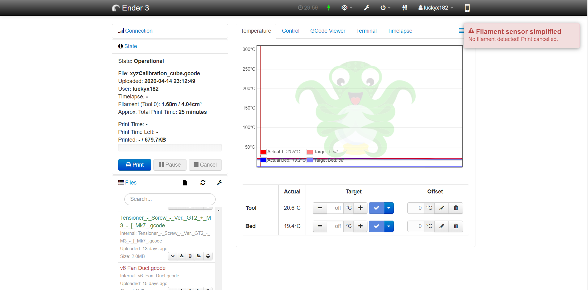

# Filament sensor simplified

This plugin reacts to short lever microswitch output like [this](https://chinadaier.en.made-in-china.com/product/ABVJkvyMAqcT/China-1A-125VAC-on-off-Kw10-Mini-Micro-Mouse-Switch.html)
If triggered (switch open) it issues **M600 X0 Y0** command to printer.

Let's check some features:
* check if printer supports M600 when printer connected - if not user will be notified through pop-up
* very handy pop-up when printer requires user input while changing filament
* filament check at the start of the print - if no filament present it won't start printing, again pop-up will appear
* filament check at the end of filament change - just to be sure you won't start printing with no filament
* filament runouts can be repeatable which didn't work with other plugins I tried
* info pop-up when plugin hasn't been configured
* user-friendly and easy to configure
* runs on OctoPrint 1.3.0 and higher

## Setup

Install via the bundled [Plugin Manager](https://docs.octoprint.org/en/master/bundledplugins/pluginmanager.html)
or manually using this URL:

    https://github.com/luckyx182/Filament_sensor_simplified/archive/master.zip

## Configuration

Configuration couldn't be simpler, all you need is to configure listening board pin (board mode) and if the second switch terminal is connected to ground or 3.3V.

Default pin is -1 (not configured) and ground (as it is safer, read below).

**WARNING! Never connect the switch input to 5V as it could fry the GPIO section of your Raspberry!**

#### Advice

You might experience the same problem as I experienced - the sensor was randomly triggered. Turns out that if running sensor wires along motor wires, it was enough to interfere with sensor reading.

To solve this connect a shielded wire to your sensor and ground the shielding, ideally on both ends.

If you are unsure about your sensor being triggered, check [OctoPrint logs](https://community.octoprint.org/t/where-can-i-find-octoprints-and-octopis-log-files/299)

## Support me

This plugin was developed in my spare time.
If you find it useful and like it, you can support me by clicking the button below :)

## Screenshots

Plugin settings:

No configuration pop-up:

Pop-up for M600 disabled:

No filament when starting print pop-up:

